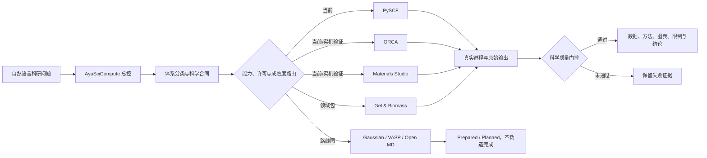

# AyuSciCompute

> Evidence-Gated Multi-Engine Agent for Molecular and Materials Simulation


**AyuSciCompute（阿遇科学计算智能体）** 是面向分子、材料与多尺度模拟的理论计算智能体执行框架。它把中文或英文科研问题转成可审计的计算合同，选择和调用真实数值引擎，监控运行，验证收敛与目标物性，最终输出可追溯的结果、方法、限制和科研结论。

语言模型负责理解、规划和调度；PySCF、ORCA、Materials Studio 等独立引擎负责数值计算；证据门控负责阻止未收敛、缺少输出或根本没有运行的任务被包装成科研结果。

## 平台愿景

AyuSciCompute 的长期边界不是某一种材料或某一个软件，而是一套可扩展的理论计算“操作系统”：

- 有机/无机小分子、离子、配合物和金属团簇；
- 高分子、凝胶、生物质、溶剂化和分子动力学；
- 金属、晶体、磁性材料、表面、界面、缺陷和吸附；
- 量子化学、第一性原理、经典 MD 与结果分析；
- 本地工作站、未来集群/调度器以及不同语言模型之间的可移植执行协议。

当前版本提供经过实现或验证的 PySCF、ORCA、Materials Studio 链；Gaussian、VASP 和开放 MD 后端属于明确路线图。平台按未来能力设计，但每个适配器的成熟度均公开标记，不用愿景冒充现状。

## 已有真实基础

| 后端/能力 | 当前成熟度 | 已有证据 |
|---|---|---|
| ORCA | validated adapter | 已跑通 ORCA 6.1.1 实机 smoke job；正常终止、总能、HOMO/LUMO、能隙和偶极矩已由解析器提取 |
| Materials Studio | validated adapter | 已跑通 MS 23.1 DMol3 实机 smoke job；完成标志和前线轨道结果已解析 |
| PySCF | CI-validated adapter | 输入、SCF、优化、频率、轨道/密度/MEP cube 已实现；合成水分子端到端测试已在 GitHub Linux CI 通过 |
| 凝胶/生物质 | implemented domain pack | 已形成化学检查、量化、结合、装箱、MD 和交付协议 |
| Gaussian | planned adapter | 后续增加；当前版本不得声称执行 |
| VASP | planned adapter | 后续增加金属、周期材料、表面、缺陷、吸附、能带/DOS 等工作流；当前版本不得声称执行 |

ORCA 实机 smoke 结果包括：总能 `-76.381935997111 Eh`、HOMO `-9.0405 eV`、LUMO `1.5999 eV`、能隙 `10.6404 eV` 和偶极矩 `2.17715727 D`。这些数值验证的是执行与解析链，不是跨方法精度基准。

## 核心架构



## 为什么不是普通脚本集合

| 常见问题 | AyuSciCompute 的处理方式 |
|---|---|
| 聊天模型凭知识直接报数 | 数值必须来自真实引擎原始输出 |
| 软件退出码为 0 就算成功 | 分离进程完成、电子/几何收敛和科学验收 |
| 一个脚本只适配一个课题 | 总控、领域包和引擎适配器分层扩展 |
| 未来能力与当前能力混写 | `validated / implemented / scaffolded / planned` 四级成熟度 |
| 商业软件或赝势混进仓库 | 仅提供互操作层，许可证、POTCAR 和程序由用户合法取得 |
| 换成 DeepSeek 就不会操作 | 跨模型运行合同明确工具、文件、进程和证据要求 |
| 失败计算被删掉或润色 | 原始日志、失败状态和质量警告必须保留 |

## Skills 组成

```text
skills/
  scientific-compute-orchestrator/  通用理论计算总控
  gel-biomass-compute/              凝胶、生物质和高分子领域包
  pyscf-runner/                     开源分子量化适配器
  orca-runner/                      ORCA 适配器（用户自备许可）
  materials-studio-runner/          MS/DMol3/Forcite 适配器（用户自备许可）
```

新用户或其他模型应从 `skills/scientific-compute-orchestrator/SKILL.md` 开始。总控会按任务调用领域包或具体引擎 Skill。

## 证据成熟度

| 等级 | 状态 | 可作何种声明 |
|---|---|---|
| E0 | Planned | 研究问题和路线已定义 |
| E1 | Prepared | 输入、脚本或命令已生成，未运行 |
| E2 | Executed | 有真实进程和原始输出，尚未科学验收 |
| E3 | Validated | 正常终止、收敛和目标物性通过任务门控 |
| E4 | Reproduced | 独立环境或重复计算复现并记录偏差 |

## 快速开始

安装全部 Skills：

```powershell
python tools/install_skills.py --target "$env:USERPROFILE\.codex\skills"
```

建立一个通用理论计算项目：

```powershell
python skills/scientific-compute-orchestrator/scripts/scaffold_project.py `
  --project-root ./projects/example `
  --name example `
  --request "优化结构并计算HOMO、LUMO和ESP" `
  --task-type homo-lumo `
  --engine auto `
  --structure ./molecule.xyz `
  --charge 0 `
  --multiplicity 1
```

运行发布验证：

```bash
python tools/validate_repository.py
python tools/run_evals.py
python -m unittest discover -s tests -v
```

仅有网页聊天能力的模型无法打开本机 ORCA、Materials Studio、Gaussian 或 VASP。它只能准备 E0/E1 材料，不能声称计算完成。

## 科学和许可边界

- 小分子 HOMO/LUMO、ESP、电荷和结合能依赖构象、质子化、方法、基组和溶剂；
- 金属/配合物需要检查氧化态、自旋态、相对论效应和多参考风险；
- 周期材料需要检查赝势、截断能、k 点、磁序、超胞和有限尺寸收敛；
- MD 需要力场适用性、平衡证据、生产段长度、重复模拟和不确定性；
- 不上传未发表结构、客户数据、商业程序、许可证、POTCAR 或私有轨迹；
- 本项目不会激活、破解或绕过第三方软件许可证；
- 计算收敛不等于机理成立，更不等于实验性能已被证明。

## 文档

[架构](docs/ARCHITECTURE.md) · [能力矩阵](docs/CAPABILITIES.md) · [先进性与相关工作](docs/RELATED_WORK.md) · [科学验证](docs/SCIENTIFIC_VALIDATION.md) · [验证证据](docs/VALIDATION_EVIDENCE.md) · [路线图](ROADMAP.md) · [安全边界](SECURITY.md) · [许可证](docs/LICENSING.md)

## 项目状态

版本：`0.3.0-rc1`。这是可公开审阅的研究软件预览版和可扩展智能体架构，不是已经覆盖所有软件和材料体系的生产平台，也不是经过同行评议的新数值算法。

项目作者与维护者：**Chen Zeyu**，所属单位：**杭州阿遇智能科技有限公司**。

原创代码和文档采用 MIT License。PySCF、ORCA、Materials Studio、未来 Gaussian/VASP 及其他依赖保持各自许可证；本仓库不授予任何第三方软件、赝势或数据使用权。
